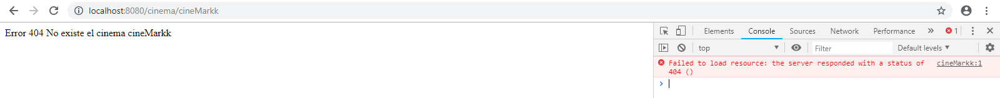

## part 1
first of all we define the main program to run on the pom.xml file, this to ensure that it is running the main we want
(CinemaAPIApplication) and not the one we create previously.
  
then we modify the file with the code provided and make some modifications:  
  
finally we add the bean to the application context.  
  
then we test the local host and check for the cinemas:  
  

for the second part we define a new method that work with the route cinema/{name} where {name} is the name of a cinema that may
belong to the data cinemas we specify.  

finally we test with an existing cinema:  
  
and with a cinema that does not exist we must get the 404 error:  

